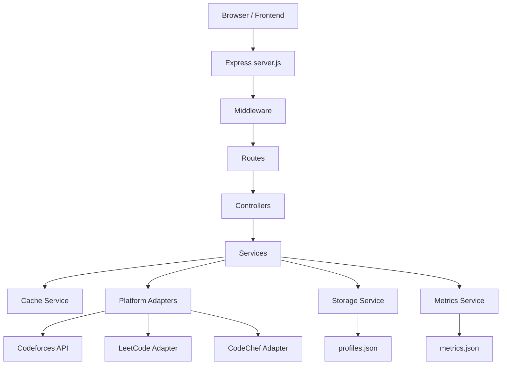
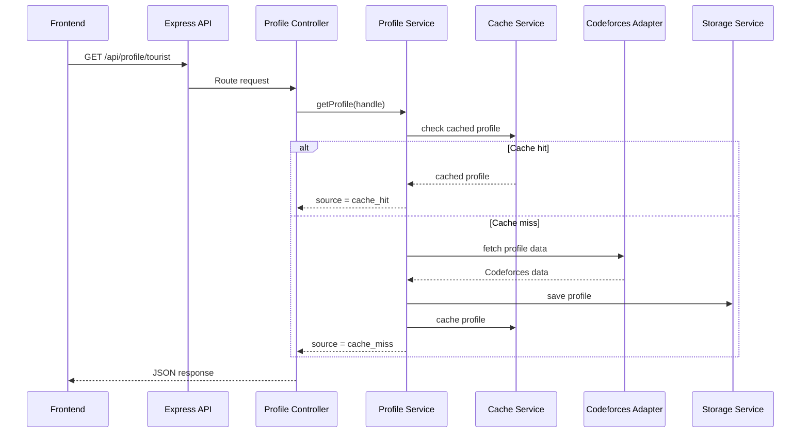

# suggestions_Dinesh.md

This document records the important review points suggested by Dinesh for the `high_throughput_cp_page` project. The goal is to keep these points inside the codebase so that future development happens with better configuration, scalability, and documentation practices.

---

## 1. Hardcoded Backend API URL in Frontend

### Question

The frontend currently hardcodes the backend API URL as `http://localhost:5000/api`. What happens if the backend runs on a different port, different machine, or deployed URL? How can we prevent the frontend from breaking whenever the backend URL changes?

### Explanation

Right now, the frontend depends on a fixed backend URL. This is risky because the backend port or deployment URL can change.

For example:

- In local development, the backend may run on `localhost:5003`.
- In production, the backend may run on a deployed domain such as `https://api.example.com`.
- In team development, each developer may use a different local backend port.

If the API base URL is hardcoded inside `frontend/app.js`, every environment change requires manually editing the source code. That is not a good practice because configuration and application logic should be separated.

The correct approach is to make the API base URL configurable. The frontend should read the backend URL from a config file, environment-like runtime config, query parameter, or fallback logic instead of permanently depending on one hardcoded value.

### What is the solution

Implement a frontend configuration layer.

Suggested approach for this vanilla HTML/CSS/JS project:

1. Create a separate frontend config file, for example:

```txt
frontend/config.js
```

2. Define a global config object:

```js
window.APP_CONFIG = {
  API_BASE_URL:
    localStorage.getItem("API_BASE_URL") ||
    window.APP_API_BASE_URL ||
    "http://localhost:5003/api",
};
```

3. Load `config.js` before `app.js` in `index.html`:

```html
<script src="config.js"></script>
<script src="app.js"></script>
```

4. Replace the hardcoded line in `app.js`:

```js
const API_BASE_URL = "http://localhost:5000/api";
```

with:

```js
const API_BASE_URL = window.APP_CONFIG.API_BASE_URL;
```

5. Add documentation explaining how to override the API URL:

```js
localStorage.setItem("API_BASE_URL", "http://localhost:5003/api");
```

This keeps the frontend flexible and prevents it from breaking when the backend URL changes.

For a future production version, use a build system like Vite and read the backend URL from `.env` files, for example:

```txt
VITE_API_BASE_URL=https://your-api-domain.com/api
```

### Prompt to Codex

```txt
In the current high_throughput_cp_page repository, fix the frontend API base URL configuration.

Problem:
frontend/app.js currently hardcodes the backend API URL as http://localhost:5000/api. This causes issues when the backend runs on a different port such as 5003 or when the app is deployed.

Tasks:
1. Create a new frontend/config.js file that exposes window.APP_CONFIG with API_BASE_URL.
2. Make API_BASE_URL configurable using this priority:
   - localStorage value named API_BASE_URL, if present
   - window.APP_API_BASE_URL, if present
   - fallback to http://localhost:5003/api
3. Update frontend/index.html to load config.js before app.js.
4. Update frontend/app.js to use window.APP_CONFIG.API_BASE_URL instead of a hardcoded URL.
5. Add a short comment explaining how developers can override the API URL locally.
6. Make sure the existing frontend behavior remains the same.
7. Do not introduce React, TypeScript, Vite, or any new frontend framework.
```

---

## 2. Rate Limiting Behavior and API Request Handling

### Question

How much rate limiting is currently applied? Why does the app start giving errors after multiple profile/API calls? Is the rate limiting happening because each user search triggers multiple platform calls and dashboard requests?

### Explanation

The backend currently has an internal rate limiter middleware. It limits API requests per client IP within a fixed time window.

The important point is that the rate limiter counts requests made to the backend API, not just external Codeforces API calls.

For example, the dashboard may call multiple backend endpoints:

```txt
GET /api/health
GET /api/leaderboard
GET /api/metrics
GET /api/profile/:handle
POST /api/profile/:handle/refresh
```

So one visible user action in the frontend may result in more than one backend request.

For example, when the dashboard loads, it may call:

```txt
/api/health
/api/leaderboard
/api/metrics
```

When a user searches a handle, it may call:

```txt
/api/profile/:handle
/api/leaderboard
/api/metrics
```

So even if the user thinks they performed only a few actions, the backend may have counted many API requests.

There is another separate issue: external platform APIs such as Codeforces may also apply their own rate limits. For a cache miss, the Codeforces adapter currently makes two external API calls:

```txt
/user.info
/user.status
```

If many new handles are searched quickly or if refresh is used repeatedly, the backend may make many external API calls and receive failures from Codeforces.

So there are two different rate limit concerns:

1. Internal backend rate limiting: protecting our own Express API.
2. External API rate limiting: avoiding too many calls to Codeforces or other platforms.

These should be handled separately.

### What is the solution

Improve the rate limiting strategy.

Recommended improvements:

1. Make internal rate limit values configurable through environment variables.

Example:

```txt
RATE_LIMIT_WINDOW_MS=60000
RATE_LIMIT_MAX_REQUESTS=100
```

2. Return a clear `429 Too Many Requests` response with useful details:

```json
{
  "success": false,
  "error": {
    "code": "RATE_LIMITED",
    "message": "Too many requests. Please try again later."
  },
  "retryAfterSeconds": 30
}
```

3. Do not apply the same strict rate limit to all endpoints. Lightweight endpoints such as `/api/health` can be excluded or given a higher limit.

4. Add a separate external API throttling layer for Codeforces and future platforms.

5. Add retry/backoff handling when external APIs return `429` or temporary failures.

6. Cache successful responses aggressively so repeated searches do not hit external APIs again.

7. Add metrics for rate limiting:

```txt
rateLimitedRequests
externalRateLimitFailures
externalApiRetries
```

This makes the system easier to debug and explain.

### Prompt to Codex

```txt
Improve the current rate limiting and external API request handling in the high_throughput_cp_page backend.

Context:
The backend currently has a rateLimiter middleware. The dashboard makes multiple API calls such as /api/health, /api/leaderboard, /api/metrics, and /api/profile/:handle. A profile cache miss also triggers external Codeforces calls. The current behavior can cause confusing 429 errors or external API failures during repeated testing.

Tasks:
1. Update backend/src/middleware/rateLimiter.js so WINDOW_MS and MAX_REQUESTS are configurable using environment variables:
   - RATE_LIMIT_WINDOW_MS
   - RATE_LIMIT_MAX_REQUESTS
2. Keep safe default values if environment variables are not provided.
3. Exclude /api/health from strict rate limiting or give it a separate lightweight limit.
4. Include Retry-After header and retryAfterSeconds in the JSON error response for 429 responses.
5. Add clear comments explaining that this is internal backend rate limiting, not Codeforces rate limiting.
6. Add or update metrics to track rateLimitedRequests.
7. Improve Codeforces adapter error messages so external 429/rate-limit errors are clearly distinguishable from our own backend rate limiter.
8. Add a small external API delay/retry/backoff helper for Codeforces calls if appropriate, but keep the implementation simple and dependency-free.
9. Update backend documentation to explain the difference between internal rate limiting and external platform rate limiting.
10. Do not add Redis, queues, or new npm dependencies in this step unless absolutely necessary.
```

---

## 3. Backend README.mdx with Architecture and Flow Documentation

### Question

Can we create a detailed `README.mdx` inside the backend folder that explains how the backend architecture works, how API requests move through the system, and how middleware, routes, controllers, services, adapters, cache, metrics, and persistence are connected?

### Explanation

The backend currently has multiple layers:

```txt
server.js
routes
controllers
services
adapters
middleware
utils
data
```

This is a good structure, but someone new to the project may not immediately understand how requests move between these layers.

A backend `README.mdx` will make the project easier to understand, explain, maintain, and present in interviews.

The README should not only explain how to run the backend. It should also explain the architecture decisions.

It should answer questions like:

- What is the role of `server.js`?
- What does middleware do?
- What do routes do?
- Why are controllers separate from services?
- Why do adapters exist?
- How does cache work?
- What does persistence mean here?
- How are metrics tracked?
- What happens during `GET /api/profile/:handle`?
- What happens during `POST /api/profile/:handle/refresh`?
- What is the difference between cache hit, cache miss, fresh fetch, and stale cache?

Since the requested format is MDX, the document can use Markdown plus future custom components if the project later uses a documentation framework such as Docusaurus or Next.js docs.

### What is the solution

Create:

```txt
backend/README.mdx
```

Recommended sections:

```txt
# Backend Architecture

## Backend Goal
## Tech Stack
## Folder Structure
## Request Lifecycle
## Middleware Layer
## Routes Layer
## Controllers Layer
## Services Layer
## Adapters Layer
## Cache Layer
## Persistence Layer
## Metrics Layer
## API Endpoints
## Error Handling
## Rate Limiting
## Local Development Setup
## Environment Variables
## Future Improvements
```

Add Mermaid diagrams for clarity.

Example architecture diagram:



Example profile request flow:



This README will become the main guide for explaining the backend to reviewers, teammates, and interviewers.

### Prompt to Codex

```txt
Create a detailed backend/README.mdx file for the high_throughput_cp_page backend.

The README.mdx should explain the backend architecture clearly for a developer who knows full-stack development but is new to this codebase.

Include these sections:
1. Backend Goal
2. Tech Stack
3. Folder Structure
4. Request Lifecycle
5. Middleware Layer
6. Routes Layer
7. Controllers Layer
8. Services Layer
9. Adapters Layer
10. Cache Layer
11. Persistence Layer
12. Metrics Layer
13. API Endpoints
14. Error Handling
15. Rate Limiting
16. Local Development Setup
17. Environment Variables
18. Future Improvements

Also include Mermaid diagrams:
1. Overall backend architecture diagram
2. GET /api/profile/:handle sequence diagram
3. Cache hit vs cache miss flow diagram
4. Rate limiter flow diagram

Make the explanation beginner-friendly but use correct backend engineering terms such as middleware, controller, service layer, adapter pattern, caching, persistence, metrics, and request lifecycle.

Keep the file as MDX-compatible Markdown. Do not use React components yet unless they are simple placeholders. Do not change backend logic in this task. Only create documentation.
```

---

## Final Implementation Priority

Recommended order of implementation:

1. Fix frontend API URL configuration.
2. Improve rate limiting configuration and error clarity.
3. Create backend/README.mdx documentation with diagrams.

This order is recommended because the API URL issue can directly break the app, rate limiting affects testing and stability, and README documentation will help explain the improved architecture clearly.
